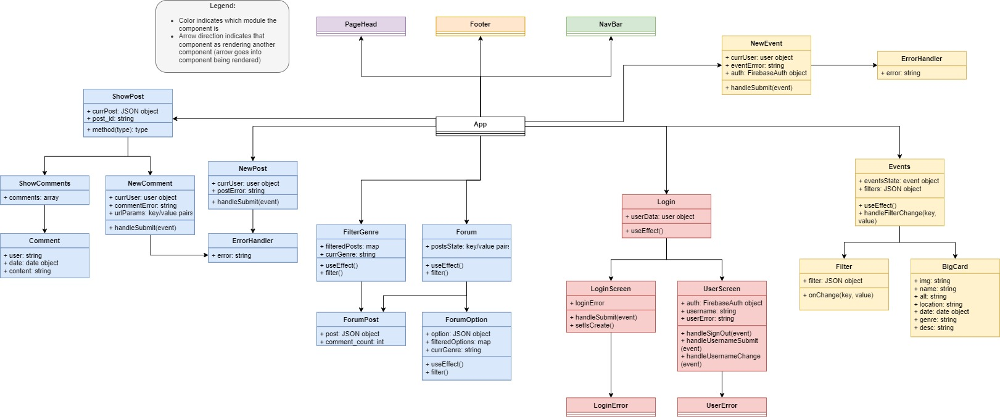
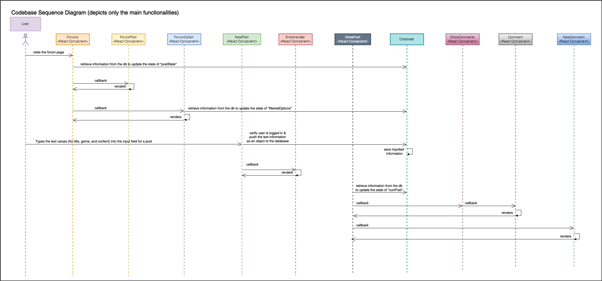
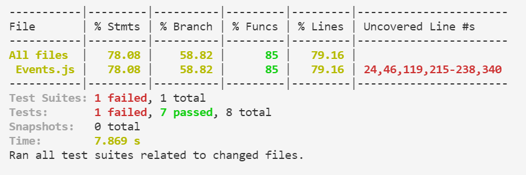
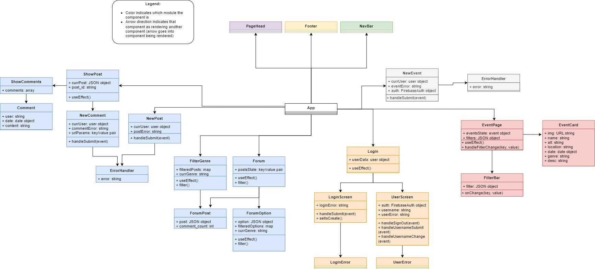

# Forte
The authors who created are Keith Ellingwood III, Niha Gaddam, Taylor Jackson, and Sebastian Augusto Pasion. This React App allows users to submit event cards of upcoming house shows, as well as discuss various topics regarding music with other users. 

## Checkpoint 2

### UML Class Diagram

### UML Sequence Diagram

## Checkpoint 3
To run the tests, open a terminal and input the following code:

    npm run test

This will run the tests automatically, showing the number of tests passed or failed, as well as what each individual test is.

These unit tests cover most of the Events.js module, except for a large chunk in the New Events function (lines 215-238). This is because we were unable to test the part of New Events that actually pushed user-provided information to a Firebase realtime database. Besides this chunk, the only untested code were lines that either were included in the final project as an accident (console.log statements), variables that are not utilized, or situations that cannot occur.

## Final Report

### 1 | Code Structure Analysis

<strong> 1.1 Choosing the Right Level of Abstraction </strong>

 Our React app, Forte, will be described mostly in terms of React components, with some of the Javascript modules also being included as elements due to their small size as well as some of the imported Javascript libraries/frameworks. 

<strong> 1.2 Architectural Elements </strong>

 Forte includes many architectural elements, including React components, Javascript modules and Javascript libraries. The following table includes each architectural element, along with its purpose: 

<table>
  <tr>
    <th>Element</th>
    <th>Purpose</th>
  </tr>
  <tr>
    <td>App</td>
    <td>Renders the web app, including each specific page and their routes</td>
  </tr>
  <tr>
    <td>PageHead</td>
    <td>Creates a header for all of the webpages</td>
  </tr>
  <tr>
    <td>Footer</td>
    <td>Creates a footer for all of the webpages</td>
  </tr>
  <tr>
    <td>NavBar</td>
    <td>Creates a navigation bar that contains links to the user profile, the events page and the forums page</td>
  </tr>
  <tr>
    <td>ShowPost</td>
    <td>Shows a specific forum post on its own web page, including all of the data of that post (i.e. title, date, author, content, likes count, etc.)</td>
  </tr>
  <tr>
    <td>ShowComments</td>
    <td>Renders the comments of a post</td>
  </tr>
  <tr>
    <td>NewComment</td>
    <td>Creates and saves data about a new comment on a post based off of inputs by users </td>
  </tr>
  <tr>
    <td>NewPost</td>
    <td>Creates and saves data about a new post based off of forms submitted by users</td>
  </tr>
  <tr>
    <td>ErrorHandler</td>
    <td>Creates an error to show to the user if there is one when displaying the form on posts</td>
  </tr>
  <tr>
    <td>FilterGenre</td>
    <td>Creates a number of posts relevant to a given genre</td>
  </tr>
  <tr>
    <td>Forum</td>
    <td>Constructs an overarching Forum page displaying existing posts, boards, and a button to create a new post</td>
  </tr>
  <tr>
    <td>ForumPost</td>
    <td>Creates a single post</td>
  </tr>
  <tr>
    <td>ForumOption</td>
    <td>Creates a single board showing the number of posts(thread count) about a specific genre</td>
  </tr>
  <tr>
    <td>NewEvent</td>
    <td>Creates and saves data about a new event based off of forms submitted by users</td>
  </tr>
  <tr>
    <td>ErrorHandler</td>
    <td>Creates an error to show to the user if there is one when displaying the form on events</td>
  </tr>
  <tr>
    <td>EventPage</td>
    <td>Constructs an overarching Event page displaying filtering options, existing events, and a button to create a new event</td>
  </tr>
  <tr>
    <td>FilterBar</td>
    <td>Creates dropdown options for filtering on Location, Date, and Genre of events</td>
  </tr>
  <tr>
    <td>EventCard</td>
    <td>Creates a single card for an event</td>
  </tr>
  <tr>
    <td>Login</td>
    <td>Creates an overarching Login page allowing users to create and sign in to accounts</td>
  </tr>
  <tr>
    <td>LoginScreen</td>
    <td>Creates a login form, and takes the inputted data to sign in the user or create an account for the user</td>
  </tr>
  <tr>
    <td>LoginError</td>
    <td>Renders an error message on the page if an error occurred while logging in</td>
  </tr>
  <tr>
    <td>UserScreen</td>
    <td>Creates a page for the user after being signed in, shows the current account that is logged in</td>
  </tr>
  <tr>
    <td>UserError</td>
    <td>Renders an error message on the page if an error occurred with the user data</td>
  </tr>
  <tr>
    <td>React</td>
    <td>Imported - library for building user interfaces</td>
  </tr>
  <tr>
    <td>Firebase</td>
    <td>Imported - library for building mobile platforms, in our case a web app</td>
  </tr>
  <tr>
    <td>MUI</td>
    <td>Imported - library for icons included in the user interface</td>
  </tr>
  <tr>
    <td>Bootstrap</td>
    <td>Imported - library for general styling of the user interface</td>
  </tr>
</table>

<strong> 1.3 Relationship Between Elements </strong>

 The <strong>App</strong> element acts as the main component of the web application, with it rendering the web app pages. Each page consists of multiple modules and many elements. The App element connects directly with ten elements: 

<ol type="1">
  <li>EventPage</li>
  <li>NewEvent</li>
  <li>Forum</li>
  <li>NewPost</li>
  <li>ShowPost</li>
  <li>FilterGenre</li>
  <li>Login</li>
  <li>NavBar</li>
  <li>PageHead</li>
  <li>Footer</li>
</ol>  

 The first seven elements are all the content of their own page, and the ‘App’ is the element that holds them all together and allows the user to go from one to another. Each of these first seven elements use smaller elements to create a piece or perform a specific task for that larger page element.
For <strong>EventPage</strong>, it is connected to the <strong>EventCard</strong> element which produces the cards containing event information, as well as the <strong>FilterBar</strong> that filters the displayed event cards. <strong>NewEvent</strong> utilizes the <strong>ErrorHandler</strong> element, allowing it better deal with errors that arise when creating new events (such as invalid info being inputted or the user not having the authority to create a new event).

<strong>Forum</strong> uses the <strong>ForumPost</strong> element to create individual posts made by users, while <strong>ForumOption</strong> creates the genre-based threads for users to comment on. The <strong>NewPost</strong> element operates similarly to <strong>NewEvent</strong>, meaning that it also allows users to create a new item to be rendered (in this case a new forum post), and utilizes an <strong>ErrorHandler</strong> element to catch and print any errors. <strong>ShowPost</strong> is the element that renders a forum post as its own page, allowing users to view more info regarding it and interact with it. This is performed by using two smaller elements to accomplish this, those being the <strong>NewComment</strong> and <strong>ShowComments</strong> elements (which renders all of the comments, using another element <strong>Comment</strong> to create the individual comments to be rendered). 

<strong>Login</strong> is connected to two other elements, <strong>LoginScreen</strong> and <strong>UserScreen</strong>. These are the possible choices for the <strong>Login</strong> element, determining what to render. Both of these screen elements also have error handlers, those being <strong>LoginError</strong> and <strong>UserError</strong>.
 

<em> Figure 1: UML Class Diagram</em>

<em>  A graphic representation of the system and its software structure. Describes the system by depicting each element, the traits and functions of each element, and the relationship between it and other elements. In this case, the arrows signify the direction of the relationship, as elements with an arrow going into them are being called or rendered by the other element. </em>

 The UML class diagram above describes the overall structure of the web application system, showing how the application starts from the <strong>App</strong> element, which in turn calls each of the other page elements. These page elements then call other smaller elements to render specific pieces of the page or react to a user's input. Each color used in the diagram represents a different module in which the elements are located. 

<strong> 1.4 Process Flow </strong>

 The system starts at module <strong>‘App’</strong> to render <strong>NavBar</strong>, <strong>PageHead</strong>, <strong>EventPage</strong>, <strong>NewEvent</strong>, <strong>Forums</strong>, <strong>NewPost</strong>, <strong>Login</strong>, <strong>ShowPost</strong>, <strong>FilterBar</strong>, and <strong>Footer</strong> each from corresponding modules. 
<strong>EventPage</strong> updates the state with the retrieved event objects from the database and renders <strong>EventCard</strong> with it to display all the existing events, along with <strong>FilterBar</strong> to display the filtering options. 
<strong>NewEvent</strong> pushes the inputs about an event received from the users to the database on a condition that the user is logged in when the button is clicked. It also renders <strong>ErrorHandler</strong> to display an error occurred when submitting the form if there is one. 
Similarly to <strong>EventPage</strong>, <strong>Forums</strong> updates the state with the retrieved post objects from the database and renders <strong>ForumPost</strong> with it to display all the existing posts, along with <strong>ForumOption</strong> to display boards that contain a thread count of each genre. 
<strong>NewPost</strong> pushes the inputs about a post received from the users to the database on a condition that the user is logged in when the button is clicked. It also renders <strong>ErrorHandler</strong> to display an error occurred when submitting the post if there is one. 
<strong>ShowPost</strong> displays a more detailed version of the posts (relative to <strong>ForumPost</strong> aforementioned) in that it renders <strong>NewComment</strong> to provide a textarea for the user to submit a comment input, as well as <strong>Comment</strong> to display all the relevant comments. It updates the state with the retrieved post objects from the database in the first place to do the above.
<strong>NewComment</strong> renders <strong>ErrorHandler</strong> to display an error occured when submitting the comment if there is one.
<strong>Login</strong> updates the ‘userData’ state with the retrieved user object from the database and renders either <strong>LoginScreen</strong> or <strong>UserScreen</strong> depending on whether the ‘userData’ is defined (in other words logged in) or not. 
<strong>LoginScreen</strong> renders <strong>LoginError</strong> to display an error occurred when logging in if there is one. Similarly, <strong>UserScreen</strong> renders <strong>UserError</strong> to display the error for the corresponding situation as well. 

<em> Figure 2: UML Sequence Diagram </em>

<em> A graphical diagram that illustrates the order of interaction between different components to capture how operations are carried out in the app using vertical dotted lines (for each component) to represent time and horizontal arrows that extend between the vertical lines to represent actions performed between the components. what data was sent from which component to another. Reading this diagram begins at the top-left with the user of the system. </em>

 The UML Sequence Diagram above describes the major functionalities of the Forums.js module, which in turn is that of the system. Events.js and Forums.js are two primary modules that define most of the functionalities, but as they both show similar interactions among components within, depicting the interactions in Forums.js suffice to explain how the system works. The diagram models the logic of operation and conveys how components interact with each other to complete the process. 

### 2 | Architecture Deficiencies & Refactoring 

 We chose to analyze the Events.js module as it consists of the right number of components, which in turn gives us an appropriate level of abstraction already without having to filter out ones to focus on. 

<table>
  <tr>
    <th>Deficiency</th>
    <th>Location</th>
    <th>How It's Fixed</th>
  </tr>
  <tr>
    <td>[Code Smell] Functions having mysterious names (doesn’t sufficiently convey what the functions are doing)</td>
    <td>Inside ‘Events’ module</td>
    <td>Changed the names (from left to right): 
    Event → EventPage 
    Filter → FilterBar 
    BigCard → EventCard</td>
  </tr>
  <tr>
    <td>Functional problem with ‘NewEvent’ component re-rendering infinitely</td>
    <td>Inside ‘NewEvent’ component</td>
    <td>Wrapping ‘onAuthStateChanged()’ method with ‘UseEffect()’ hook</td>
  </tr>
  <tr>
    <td>Having invalid attribute ‘type=’ within <Form.Control> Elements</td>
    <td>Inside ‘NewEvent’ component</td>
    <td>Removing ‘type=’ attributes in all <strong>Form.Control</strong> elements<td>
  </tr>
  <tr>
    <td>NewEvents is a different page not dependent on Events, so can be a different module rather than included in Events.js</td>
    <td>Inside ‘Events’ module</td>
    <td>Move NewEvents to a different module by itself, correct import statement in App.js</td>
  </tr>
  <tr>
    <td>[Readability] Using unclear conditions for if statements</td>
    <td>Inside ‘useEffect’ and ‘handleSubmit’ in the ‘NewEvent’ component</td>
    <td>Clarify condition for if statements by writing boolean expressions rather than using a state variable’s value</td>
  </tr>
  <tr>
    <td>Temporary field, fields are only set in certain circumstances</td>
    <td>Inside the ‘handleSubmit’ of ‘NewEvent’</td>
    <td>Initialize the variables outside of the loop</td>
  </tr>
  <tr>
    <td></td>
    <td></td>
    <td></td>
  </tr>
</table>

### 3 | Unit Tests

<strong> 3.1 Running the Test Suite </strong>

 All of our tests can be found in 'src/Events.test.js', which is able to run thanks to the setupTests.js file also found in the src folder. To run the tests, navigate to the 'project-1-taylorjackson10' directory, open a terminal, enter the command 'npm run test'. After this is entered, the terminal will prompt the user for another command. To run all of the tests, the user should then enter 'a'. Doing so will run each test, showing the number of tests that passed or failed as well as what each individual test is. If a test fails, the test will print our an error in the terminal containing the error statement. 

<strong> 3.2 Tests and Justification </strong>

<table>
  <tr>
    <th>Tests</th>
    <th>Justification</th>
  </tr>
  <tr>
    <td>Determine if the EventPage renders correctly when given starting events data</td>
    <td>This test is necessary as it ensures that the first core functionality of the EventPage is working, that being displaying event cards using data from the event database</td>
  </tr>
  <tr>
    <td>Determine if the EventPage can correctly send the user to the NewEvent page when requested</td>
    <td>This test is required as it checks if the other core functionality of the EventPage is working, that being allowing the user to navigate to another page</td>
  </tr>
  <tr>
    <td>Determine if the FilterBar has each input box labeled clearly when the site first loads</td>
    <td>This test ensures that the FilterBar is ready to use when a user loads the page, as without the label values a user may be confused as to how correctly operate the filter</td>
  </tr>
  <tr>
    <td>Determine if the FilterBar can have values selected by the user</td>
    <td>This test makes sure that the FilterBar is operational to the user, allowing them to interact with it to choose the event criteria they are interested in</td>
  </tr>
  <tr>
    <td></td>
    <td></td>
  </tr>
  <tr>
    <td></td>
    <td></td>
  </tr>
  <tr>
    <td></td>
    <td></td>
  </tr>
  <tr>
    <td>Determine if the ErrorHandler displays the correct value when called</td>
    <td>This test ensures that the ErrorHandler performs its sole job correctly when needed by the NewEvent element</td>
  </tr>

  
<strong> 3.3 Test Coverage and Results</strong>
