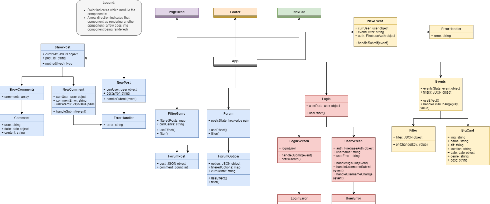

# Forte
The authors who created are Keith Ellingwood III, Niha Gaddam, Taylor Jackson, and Sebastian Augusto Pasion. This React App allows users to submit event cards of upcoming house shows, as well as discuss various topics regarding music with other users. 

## Checkpoint 2

### UML Class Diagram

### UML Sequence Diagram
